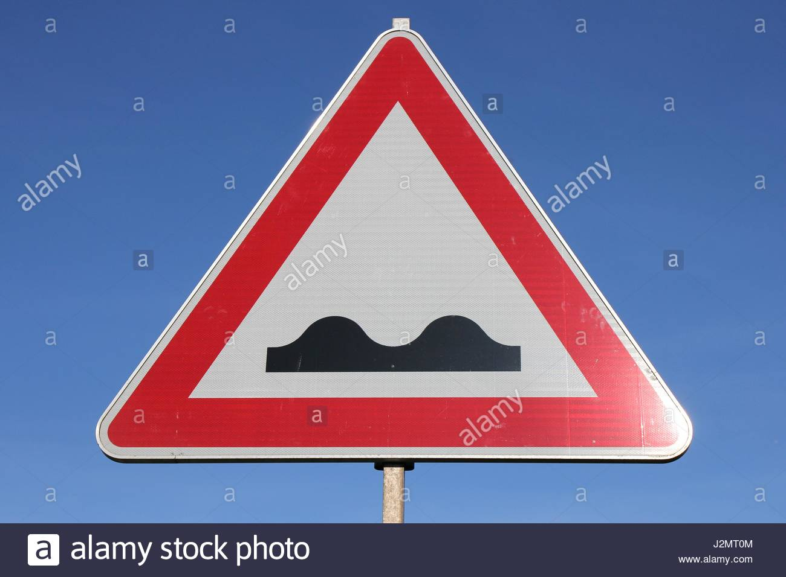
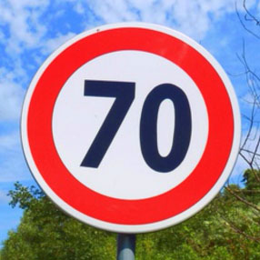

# Traffic Sign Recognition

---

**Build a Traffic Sign Recognition Project**

The goals / steps of this project are the following:

* Load the data set (using [German Traffic Sign Dataset](http://benchmark.ini.rub.de/?section=gtsrb&subsection=dataset))
* Explore, summarize and visualize the data set
* Design, train and test a model architecture
* Use the model to make predictions on new images randomly downloaded on the web
* Analyze the softmax probabilities of the new images

[//]: # (Image References)

[image1]: ./Y-Label.jpg

---

### Data Set Summary & Exploration

#### 1. Use `numpy.shape` to get the shape of the data set.

#### 2. Use `pandas.value_counts()` to get the distribution of labels.

Here is an exploratory visualization of the data set. It is a bar chart showing how the labels distribute in training, validation and test datasets.

![alt text][image1]

### Design and Test a Model Architecture

#### 1. For normalization, I divided the images by 255 to scale the data between 0 and 1.

#### 2. My model basically follows the structure of Lenet.

My final model consisted of the following layers:

| Layer         		|     Description	        					| 
|:---------------------:|:---------------------------------------------:| 
| Input         		| 32x32x3 RGB image   							| 
| Convolution 5x5     	| 1x1 stride, valid padding, outputs 28x28x6 	|
| Relu					|												|
| Max pooling 2x2	    | 2x2 stride, outputs 14x14x6   				|
| Convolution 5x5	    | 1x1 stride, valid padding, outputs 10x10x16	|
| Relu                  |                                               |
| Max pooling 2x2		| 2x2 stride, outputs 5x5x16     				|
| Fully connected		| outputs 120 hidden nodes						|
| Fully connected		| outputs 84 hidden nodes						|
| Fully connected       | outputs 43 logits                             |
| Softmax               | outputs 43 probabilities                      |

#### 3. Training

To train the model, I choose the `Adam` as my first choice, which combines the advantages of `RMSprop` and `Momentum`, and the hyperparameters I used are shown below:

| Hyperparameter | Value  |
|:--------------:|:------:|
| Batch Size     |128     |
| EPOCHS         |10      |
| Learning Rate  |0.01    |

#### 4. Discussion

My final model results were:

* the training set accuracy of 1, apparently, it is overfitting.
* the validation set accuracy of 0.952
* the test set accuracy of 0.903

As the model shown above, I chose Lenet as my CNN architecture and luckily the training results of my first architectural selection met the accuracy requirements. 

The results showed that Lenet is very powerful in image classification. Also, there are some other tricks I used to improve the model like a small learning rate and a `xavier_initializer()` which can make the gradients contour more round.

There are some other ways I think would help improve the model's performance.

* Turn images into gray scale
* Augment the training data by rotating or shifting images or by changing colors
* Use dropout layer instead of max pooling layer
* Add batchnorm layer

### Test a Model on New Images

#### 1. New German traffic signs

Here are seven German traffic signs that I found on the web:

The 1st, 2nd, 4th, 7th images contain watermarks, which may cause the model to fail.

#### 2. Prediction and probabilities on each new images

Here are the results of the prediction:

| Image			        |     Prediction	     | Probability |
|:---------------------:|:-----------------------:|:----------------------:| 
| Bicycles Crossing  		| Stop   				| 0.999 |
| Bumpy Road     			| Stop 					| 0.863 |
| Roadworks					| Roadworks			    | 1 |
| Slippery Road	      		| Speed limit 120km/h	| 0.778 |
| Speed Limit 70km/h		| Speed Limit 70km/h	| 0.999 |
| Stop                      | Stop                  | 0.999 |
| Wild Animals Crossing     | Slippery road         | 0.999 |

The model gives an accuracy of 42.8%, which is much lower than it performed on the test set.
And even for the misclassified images, it gives a very high certainty.

#### 3. Discussion on misclassified new images

We can see that the results above are very interesting. 
And there is a commonality for the misclassified pictures, that is, they all have watermarks.
For the human eye, we can easily ignore the impact of the watermark. But for CNNs, this seems to be fatal, like a specific attack.

For this problem, I think there may be two solutions:

* Add watermarked images to the training set, it should be the most effective way.
* Use Gaussian blur to fade the watermarks.

